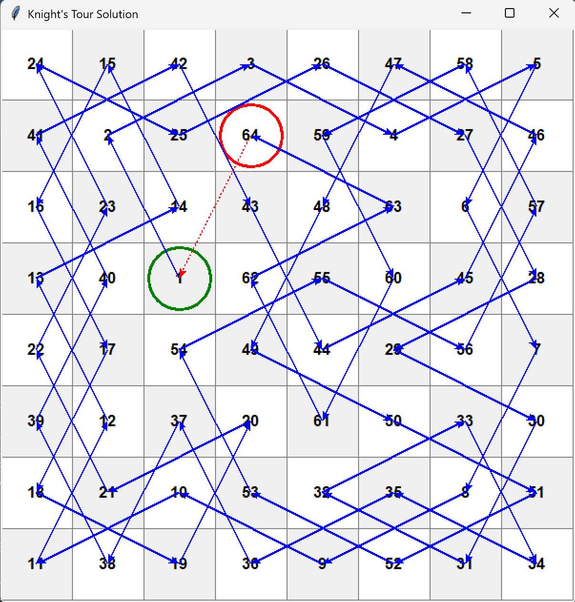

# FP-Teori-Graf | Kelompok 12

| Nama | NRP |
| :---: | :---: | 
| Davin Adiputra Suryolaksana | 5025241220 |


# 1 Knight's Tour Problem

## Penggunaan Program Knight's Tour

Program ini menyelesaikan masalah Knight's Tour menggunakan algoritma backtracking dengan heuristik Warnsdorff.

### Cara Menjalankan
Pastikan Python sudah terinstall. Jalankan program melalui terminal atau command prompt:

```bash
python knights_tour.py
```

### Input
Setelah program dijalankan, input:

1.  **Posisi Awal X**: Koordinat baris awal kuda (1-8).
2.  **Posisi Awal Y**: Koordinat kolom awal kuda (1-8).
3.  **Tipe Tour**:
    *   Ketik `o` untuk **Open Tour** 
    *   Ketik `c` untuk **Closed Tour** 

**Contoh Input:**
```
Masukkan posisi awal x (1-8): 0
Masukkan posisi awal y (1-8): 0
Pilih tipe tour - open (o) / closed (c): c
```

### Output
*   **Open Tour | Posisi Awal (1,1)**
    
*   **Closed Tour | Posisi Awal (4,3)**
    
### Kebutuhan
*   Python 3.x
*   Library `tkinter` 

# 2
